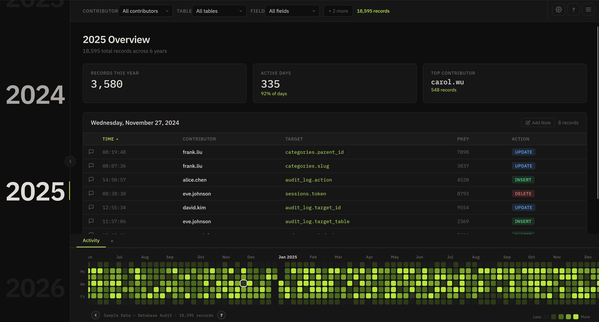

# Timeline Dashboard

A read-only investigation tool for large time series datasets. Load a CSV with a timestamp column and get a GitHub-style
contribution heatmap spanning years, with faceted filters, cell/row/column highlighting, multi-day selection summaries,
and per-day and per-row annotations.



## Features

- **Scrollable multi-year heatmap** with configurable metric tabs (count, count distinct, sum, avg, min, max, volume)
- **Faceted filters** with exclude and highlight modes, multi-value selection, and per-filter color assignment
- **Selection system** — click, row, column, month, year, and rolling-week selections with keyboard shortcuts and
  undo/redo
- **Signed metrics** — diverging color scale with hand-picked negative palette ramps for financial and other signed data
- **Annotation system** — per-day and per-row notes with sticky headers, truncation, and export
- **12 color themes** including high-contrast mode
- **Sample datasets** — Database Audit, Financial Transactions, and IT Ticketing; no data required to try it out

## Quick Start

Go to https://PC-You.github.io/timeline-dashboard to access the latest release.

Or load a CSV by dropping it on the page or using **Menu → Load CSV**.

## CSV Format

Any CSV (or TSV, or pipe-delimited) with a timestamp column. The parser auto-detects the delimiter and looks for any of
these timestamp column names:

`timestamp`, `ts`, `datetime`, `date`, `time`, `created_at`, `created`, `occurred`, `event_time`, `event_date`

Supported date formats: ISO 8601, Oracle DD-MON-YY, and most standard date strings. All other columns become filters and
log table columns automatically. A manual date column picker is planned for v0.4.5.

## Keyboard Shortcuts

| Shortcut        | Action                                   |
|-----------------|------------------------------------------|
| Click           | Select day, clear highlights             |
| Ctrl+Click      | Toggle day into multi-selection          |
| Shift+Click     | Select entire row (day of week)          |
| Alt+Click       | Select entire column (week)              |
| M+Click         | Select entire calendar month             |
| Y+Click         | Select entire calendar year              |
| W+Click         | Select 7 days starting from clicked cell |
| Ctrl+A          | Select all cells                         |
| Esc             | Clear all selections                     |
| Arrow keys      | Navigate ±1 day / ±1 week                |
| Ctrl+Z / Ctrl+Y | Undo / redo selection                    |

Hold Ctrl with any of the above modifiers to add to the existing selection. Full shortcut list available in-app via the
`?` button.

## Privacy

No data leaves your browser. No telemetry, no external API calls, no cookies. Everything runs locally — load your CSV,
investigate, save your state as JSON for later, and close the tab when done.

## Development

```bash
# Serve the project root
python -m http.server 8080
# or npx serve .
# or VS Code Live Server
```

Open `http://localhost:8080`. ES modules require HTTP — `file://` will not work.

### Project Structure

```
timeline-dashboard/
├── index.html            HTML shell
├── css/dashboard.css     All styles
├── js/
│   ├── state.js          Shared state, constants, app registry
│   ├── schema.js         Schema detection + sample data schemas
│   ├── csv.js            CSV parser + sample data generators
│   ├── data.js           Ingest, indexing, filtering, aggregation
│   ├── filters.js        Faceted multi-select filters
│   ├── notes.js          Day and row notes
│   ├── highlights.js     Row/column/day highlighting
│   ├── heatmap.js        Heatmap rendering, tooltips
│   ├── sidebar.js        Year navigation sidebar
│   ├── content.js        Content pane (stats, log, summary)
│   ├── themes.js         12-palette theme system
│   └── main.js           Entry point, boot, wiring
└── VERSION               Version source of truth
```

### Architecture

Data flows through a single pipeline regardless of source:

```
Source (CSV, future: API, WebSocket)
  ↓
schema.js → detectSchema() or predefined schema
  ↓
data.js → ingest(records, schema)
  ↓
state.raw, state.filtered, state.dayValues, state.dayEntries
  ↓
Render pipeline (all schema-driven)
```

The schema object tells the pipeline how to interpret generic records — which column is the timestamp, which are filter
facets, which are log columns, how to aggregate for the heatmap, and so on. See `sampleDataSchema()` in `schema.js` for
a fully configured example.

To add a new data source (REST API, WebSocket, etc.): fetch records as plain objects, define a schema, call
`ingest(records, schema)`, then `app.fullRender()`.

## Roadmap

See [SOW.md](SOW.md) for the full scope of work. Short version:

- **v0.4.x (current)** — Polish and sample data expansion. Date column picker and async support in progress.
- **v0.5–0.7** — Drill-down reports, inline visualizations, comparison mode, chunked CSV loading.
- **v0.7–0.9** — Streaming data sources, windowed memory management, collaboration features.
- **v1.0+** — Plugin system, embeddable widget.

## Contributing

Bug reports and feature requests welcome via [Issues](../../issues). The in-app **Report a Bug** button downloads a
diagnostic JSON you can attach.

Pull requests welcome. Please target the current development branch and include a brief description of the change. The
codebase is vanilla ES modules with no build dependencies; there is no npm/yarn/vite — just modules loaded directly by
the browser.

## License

© 2026 Jordan Roberts. Licensed under the GNU General Public License v3.0 — see [LICENSE](LICENSE).
